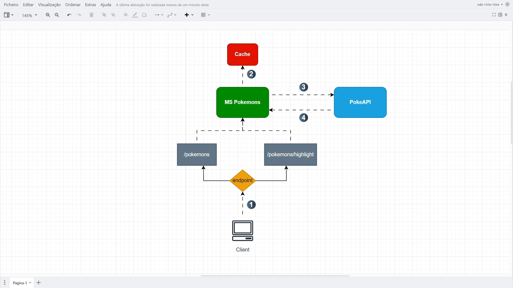

# Aplicação que tem a ideia de um Microsserviço responsável pelo consumo da API de Pokemons  [](https://github.com/jvmaiaa/looqbox-backend-challenge/blob/main/LICENSE)

## Sobre o projeto

Projeto que consiste em realizar uma requisição na **PokéApi** para ordenar todos os pokemons de acordo com o parâmetro que for passado. Utilizei o **WebClient** para consumir a API. Implementei também todas as ordenações de maneira manual, detalhando de forma passo a passo a complexidade do algoritmo desenvolvido **(variação do bubble sort)**. Incluí também exceções personalizadas para tratar erros que possam ocorrer durante a execução da aplicação. Além disso, setei o endpoint que será consumido no `application.properties` para seguir boas práticas e evitar o alto acoplamento. Além disso, realizei a dockerização da aplicação para rodar em qualquer dispositivo que tenha docker instalado.

## Diagrama detalhado da Arquitetura
Site utilizado para estudar [Diagrama de Arquitetura](https://c4model.com)

A partir deste diagrama é possível entender a ordem que deveria ocorrer cada comportamento da aplicação.


## Documentação e endpoints disponíveis - Swagger
Caso você queira ver todas as rotas (endpoints) disponíveis, inicialize o projeto e acesse a seguinte URL pelo seu navegador: `http://localhost:8080/swagger-ui/index.html`

## Tecnologias e suas versões
<table>
  <tr>
    <td>Java</td>
    <td>Spring Boot</td>
    <td>SpringDoc OpenApi - (Swagger)</td>
    <td>WebClient</td>
  </tr>
  <tr>
    <td>17</td>
    <td>3.4.1</td>
    <td>2.8.3</td>
    <td>...</td>
  </tr>
</table>

## Como Executar o projeto
Pré requisitos:
- Ter o `git` instalado na máquina.
- Ter o `Docker` instalado na máquina. 
- Algum Client para testar as rotas (endpoints). Recomendo o `Postman` por ser simples e amigável.

Passos a serem executados:
1. `git clone https://github.com/jvmaiaa/looqbox-backend-challenge.git`
2. `cd looqbox-backend-challenge`
3. `gradlew clean build`
4. `docker build -t imagem-looqbox-challenge .` -> **Precisa estar com o docker sendo executado**
5. `docker run -p 8080:8080 --name container-looqbox-challenge imagem-looqbox-challenge -d`

## Endpoints -> URL disponíveis
-> OBS: O projeto deve estar em execução antes de realizer qualquer ação para a URL de cada entidade ser acessada

Parâmetros que podem ser passados:
- `query`: Informa o prefixo do nome de algum pokemon a ser buscado. **Comportamento padrão: Buscar todos os pokemons existentes na API externar**.
- `sort`: Informa o tipo de ordenação que será utilizado. Os tipos existentes são os seguintes: 
  - `ALPHABETICAL` (algoritmo de ordenação por ordem alfabética)
  - `LENGTH` (algoritmo de ordenação por quantidade de caracteres). **Comportamento padrão: Utilizar `ALPHABETICAL` como ordenação**.

<details>
<summary>/pokemons</summary>

Você irá realizar a requisição na URL `localhost:8080/pokemons` para que possa ser buscado todos os pokemons que estão disponíveis na API externa.

Busca Pokemons - **GET** -> `localhost:8080/pokemons`
```
{
    "result": [
        "wailmer",
        "wailord"
    ]
}
```
</details>

<details>
<summary>/pokemons/highlight</summary>

Irá ser feito uma requisição para os pokemons buscados, mas trazendo também os prefixo que foi buscado, de forma destacada.

Busca Pokemons e prefixo buscado - **GET** -> `localhost:8080/pokemons/highlight`
```
{
     "result": [
        {
            "name": "wailmer",
            "highlight": "<pre>wai</pre>lmer"
        },
        {
            "name": "wailord",
            "highlight": "<pre>wai</pre>lord"
        }
    ]
}
```
</details>

## Possíveis pontos de melhoria

- **Algoritmo**: O algoritmo escolhido por mim tem a complexidade de O(n²), o que torna o processamento mais custoso conforme a quantidade de itens da lista aumenta. Mas decidi escolher essa implementação por ser mais simples de implementar/compreender. Essa ordenação poderia ser implementada de uma forma melhor, com algoritmos como MergeSort ou Quicksort.

- **Cache**: Até o momento, a aplicação não possui cache (eu implementaria com Redis por ser mais simples e ágil), mas pensei que poderia ser aplicado manualmente da seguinte: toda vez que alguns dos endpoints fossem acessados, eles teriam uma lista (lista que seria implementada na classe que faz o o consumo da API), se essa lista estivesse vazia faria o consumo para API externa e salvava todos os itens na lista de cache, após isso, faria a filtragem e ordenação a partir da lista de cache. E dentro da mesma classe que faz o consumo da API (classe que cria fornece a lista em cache), faria uma lógica para a cada 30 minutos, esvaziar a lista e trazer novos dados.

- **Limitação de requisição por usuário**: Poderia ser feita uma limitação de requisição para evitar sobrecarregar o servidor (essa solução seria feita apenas caso o cache não fosse implementado, já que caso a aplicação aplicasse cache, sempre teria a lista armazenada em cache).

- **Réplica do banco**: Caso o problema fosse pensado em nível de arquitetura cloud (infra), poderia ser criada uma réplica do banco (caso a API fosse interna da empresa) para que não sobrecarregasse as transações do banco.
